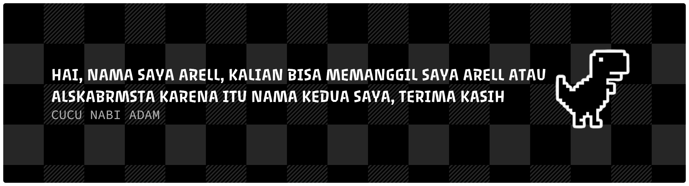

## Hi Guys, aku Arell 😉

 

<h5>STOP MENORMALISASIKAN JUDI ONLINE DI HIDUP KALIAN😟, JUDI ONLINE ITU PENIPUAN😡</h5>

#### ABOUT ARELL 😁

###

  
  
  
  
  

  
  
  
  
  
  

###

  
  
  
  
  
  

###

 

###